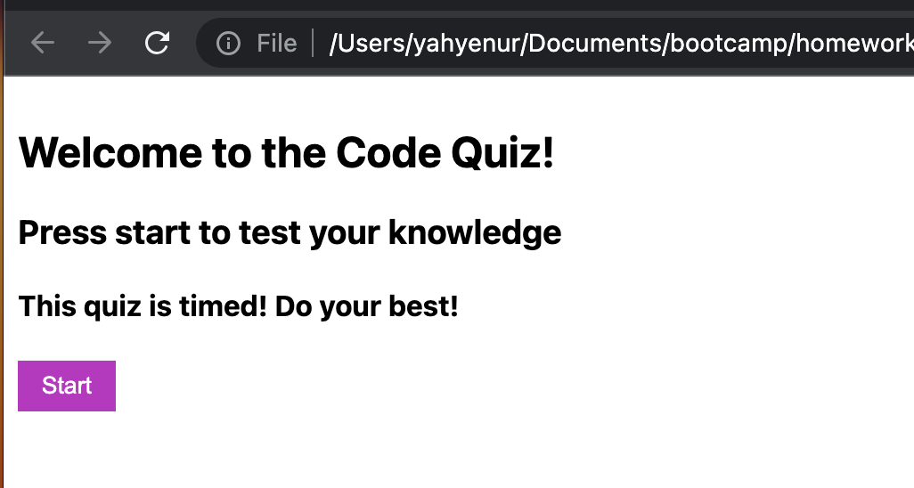

# Web-APIs-Code-Quiz

## I will build a timed coding quiz with multiple-choice questions. This app will run in the browser and will feature dynamically updated HTML and CSS powered by JavaScript code that I will write. It will have a clean, polished, and responsive user interface.

- no user instruction
  
  (Deployed Application)[https://yamyam500.github.io/Web-APIs-Code-Quiz/index.html]
